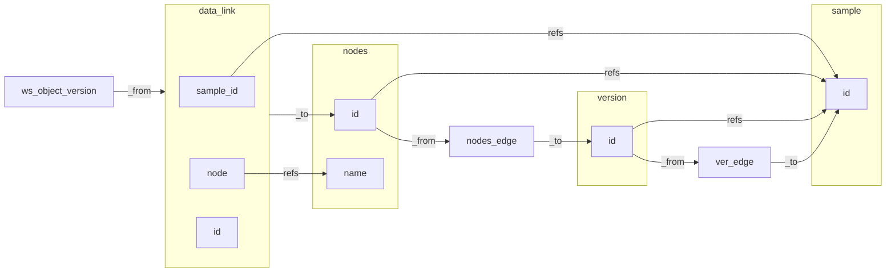

```mermaid
flowchart LR
    
    subgraph sample
      id_sample[id]
    end
      
    id_node -- refs --> id_sample
    subgraph nodes
      id_node[id]
      name_node[name]
    end
    
    sampleid_data_link -- refs --> id_sample
    ws_object_version -- _from --> data_link -- _to --> id_node
    node_data_link -- refs --> name_node
    subgraph data_link
      id_data_link[id]
      node_data_link[node]
      sampleid_data_link[sample_id]
    end
    
    id_version -- refs --> id_sample
    subgraph version
      id_version[id]
    end 
   
    
    id_node -- _from --> nodes_edge -- _to --> id_version
    id_version -- _from --> ver_edge -- _to --> id_sample
        
```
