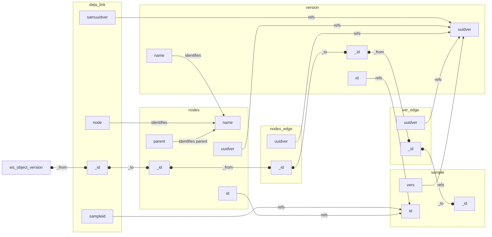

```mermaid
flowchart LR
    
    vers_sample -- refs --> uuidver_version
    subgraph sample
      _id_sample[_id]
      id_sample[id]
      vers_sample[vers]
    end
    
    sampleid_data_link -- refs --> id_sample
    node_data_link -- identifies --> name_node
    samuuidver_data_link -- refs --> uuidver_version
    subgraph data_link
      _id_data_link[_id]
      sampleid_data_link[sampleid]
      samuuidver_data_link[samuuidver]
      node_data_link[node]
    end
    
    id_node -- refs --> id_sample
    parent_node -- identifies parent --> name_node
    uuidver_node -- refs --> uuidver_version
    subgraph nodes
      id_node[id]
      _id_node[_id]
      name_node[name]
      parent_node[parent]
      uuidver_node[uuidver]
    end
    
    id_version -- refs --> id_sample
    name_version -- identifies --> name_node
    subgraph version
      _id_version[_id]
      uuidver_version[uuidver]
      id_version[id]
      name_version[name]
    end 
    
    uuidver_nodes_edge -- refs --> uuidver_version
    subgraph nodes_edge
      _id_nodes_edge[_id]
      uuidver_nodes_edge[uuidver]
    end
    
    uuidver_ver_edge -- refs --> uuidver_version
    subgraph ver_edge
      _id_ver_edge[_id]
      uuidver_ver_edge[uuidver]
    end
   
    ws_object_version -- _from o--o _id_data_link -- _to o--o _id_node
    _id_node -- _from o---o _id_nodes_edge -- _to o---o _id_version
    _id_version -- _from o--o _id_ver_edge -- _to o--o _id_sample
    

    
```
