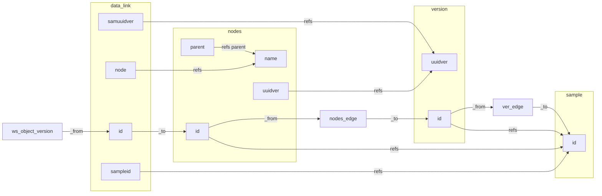

```mermaid
flowchart LR
    
    subgraph sample
      id_sample[id]
    end
    
    sampleid_data_link -- refs --> id_sample
    node_data_link -- refs ---> name_node
    uuidver_node -- refs --> uuidver_version
    samuuidver_data_link -- refs --> uuidver_version
    subgraph data_link
      id_data_link[id]
      node_data_link[node]
      sampleid_data_link[sampleid]
      samuuidver_data_link[samuuidver]
    end
    
    id_node -- refs --> id_sample
    parent_node -- refs parent --> name_node
    subgraph nodes
      id_node[id]
      name_node[name]
      parent_node[parent]
      uuidver_node[uuidver]
    end
    
    id_version -- refs --> id_sample
    subgraph version
      id_version[id]
      uuidver_version[uuidver]
    end 
   
    ws_object_version -- _from --> id_data_link -- _to --> id_node
    id_node -- _from ---> nodes_edge -- _to ---> id_version
    id_version -- _from --> ver_edge -- _to --> id_sample
    
```
