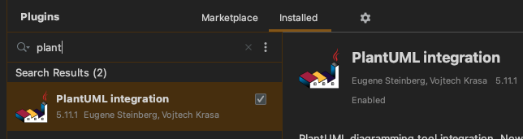
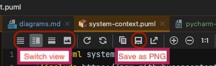
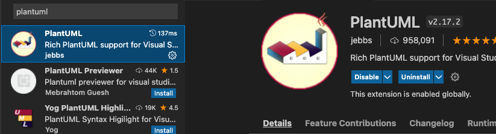

# Diagrams

Diagrams may be created with any tool but [Plant UML](https://plantuml.com) is supported within this project, at least with documentation and examples.

PlantUML is a command-line based tool which uses text-based specifications for UML and similar diagrams.

It has support within popular IDEs like Visual Studio code and PyCharm (as well as other JetBrains editors), which provide syntax highlighting, diagram preview, and export to image formats.

This project currently has an example of [C4 software architecture diagrams](https://c4model.com). This is enabled through a [C4 Plant UML plugin](https://github.com/plantuml-stdlib/C4-PlantUML).

PlantUML is distributed as a single Java jar file, and thus requires Java be available. It also requires [GraphViz](https://graphviz.org/) for preview and export.

## Using in PyCharm

All that is required to use PlantUML in PyCharm is to install the plugin "PlantUML Integration":

> This plugin ships with an integrated GraphViz binary, and PyCharm includes an integrated Java runtime; so unlike the VSC plugin, it has no system dependencies.

This plugin provides the PlantUML binary, syntax highlighting, preview, and export.

Usage is straightforward. Common operations are found in a toolbar that appears above a PlantUML document while you are editing it:

The plugin may be configured via PyCharm preferences: **Languages and Frameworks** > **PlantUML**.

### Using in Visual Studio Code

Visual Studio Code also has a fine plugin which enables syntax highlighting, preview, and export.

Requirements for this plugin are described in the plugin's description. Generally it requires Java and GraphViz be available.

