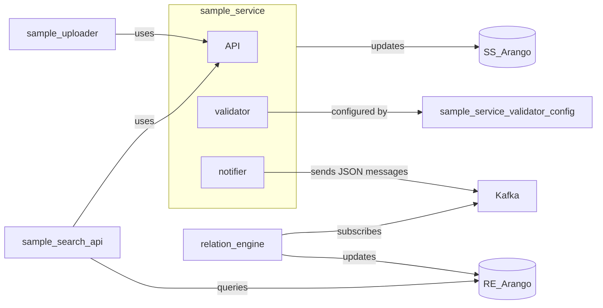

```mermaid
flowchart LR

    subgraph sample_service
      API
      validator
      notifier
    end
    

    sample_service -- updates --> ss_arango_db[(SS_Arango)]

    sample_uploader -- uses --> API
    sample_search_api -- uses --> API
    sample_search_api -- queries --> re_arango_db[(RE_Arango)]
    notifier  -- sends JSON messages --> Kafka
    validator  -- configured by --> sample_service_validator_config
    relation_engine -- subscribes -->  Kafka
    relation_engine -- updates --> re_arango_db[(RE_Arango)]
    
    click sample_uploader href "https://github.com/kbaseapps/sample_uploader" "sample_uploader"
    click sample_search_api href "https://github.com/kbase/sample_search_api" "sample_search_api"
    click sample_service_validator_config href "https://github.com/kbase/sample_service_validator_config" "sample_service_validator_config"
    click notifier href "https://github.com/kbase/sample_service/blob/master/lib/SampleService/core/notification.py" "notifier"
    click validator href "https://github.com/kbase/sample_service/tree/master/lib/SampleService/core/validator" "validator"
    click API href "https://github.com/kbase/sample_service/blob/master/SampleService.spec" "API"
    
```
