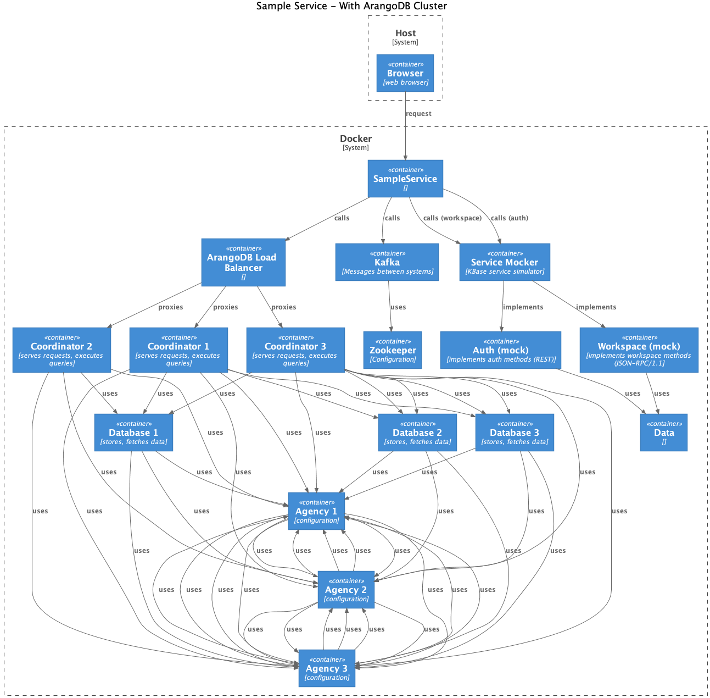

# Local SampleService with arangodb clusters

The deployment of SampleService depends on an ArangoDB database which is configured as a cluster.

Certain problems we have encountered may be linked to the usage of clusters. For example, performance and concurrency.

Therefore, in order to be able to evaluate the SampleService in the context of a (more) realistic environment, the codebase offers support for a local deployment with ArangoDB clusters. 

This does not completely simulate the standard, production clustering recommended by ArangoDB and which we utlize in our CI and production deployments.



## Quick Start

1. Start the sample service with associated services and arangodb cluster. In a terminal enter:

```
make host-start-dev-server-cluster
```

2. Run tests against the sample service

3. Stop all services:

- In the terminal exit the docker compose process with `[Ctr]C`

- stop the services and remove the containers:

```shell
make host-stop-dev-server-cluster
```

## Starting the sample service 

```shell
make host-start-dev-server-cluster
```

### Options

There are many options available, consult `dev-server-env.sh`. 

A useful one to note, though, is `ARANGO_VERSION`, which lets you set the version of arange to use for the image tag. It defaults to the current version used in KBase deployments, currently `3.5.3`.

E.g. to use the current release, version 3.9.0:

```shell
ARANGO_VERSION=3.9.0 make host-start-dev-server-cluster
```


## Stopping the sample service

This will stop all service containers and remove them.

```shell
make host-stop-dev-server-cluster
```

## The pieces

- `Makefile`
    - task `host-start-dev-server-cluster`
    - task `host-stop-dev-server-cluster`
- `scripts`
    - `dev-server-env.sh`
    - `start-dev-server-cluster.sh`
    - `stop-dev-server-cluster.sh`
- `dev`
    - `data2`
        - `Auth/*.json`
        - `Workspace/*.json`
    - `load-balancer`
        - `Dockerfile`
        - `haproxy.cfg`
    - `docker-compose-with-arango-cluster.yml`


### Makefile

Two make tasks take care of starting and stopping the cluster.

### Scripts 

Each task invokes an associated shell script.

The `dev-server-env.sh` scripts is run first and is responsible for setting up environment variables, all of which have sensible defaults. Consult it for details.

### Service mock data

The local docker workflow depends on mocking required KBase services - auth and workspace. Minimal mock data is provided in the `dev/data2` directory. This mock data provides for authentication of a "user1", who is the owner of a workspace `9` and object `1` within that workspace.

This data is adequate for testing sample creation and data linking.

### Load Balancer

Communication with arango is through it's "coordinators". A coordinator hosts the public api. A call to the arangodb api from the sample service always goes to a coordinator. The load balancer makes it easy to support multiple clients which are distributed across coordinators. Coordinators handle queries directly, computing the query execution, determining which db they need to access, etc.

Advice from arangodb is that for best performance coordinators should be colocated with the clients which are using them, if possible. E.g. there could be a coordinator assigned to the sample service, to the relation engine.

I'm not sure the load balancer is the best way to handle this, but it was interesting to set up and works fine.

The load balancer is `haproxy`. I attempted to use nginx, but it has deprecated (and removed?) support for healthchecks. haproxy has a simpler configuration, with good healthcheck support.