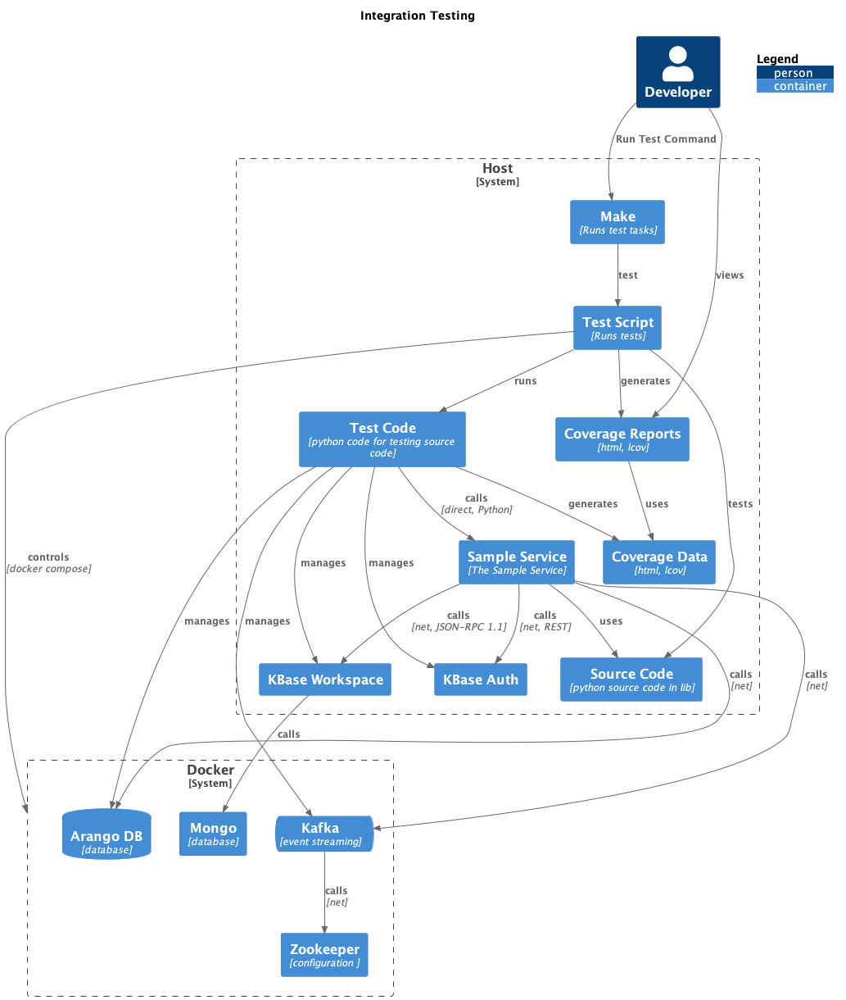

# Testing Overview

### Dependent Services

Integration tests require several services which are normally available in a KBase deployment environment.



#### KBase Services

The KBase services `workspace` and `auth` are required by integration-level tests. These services are run and managed directly by the tests themselves. They are each provided within the repo as a single jar file, located in the `test` directory:

- `test`
  - `bin`
    - `authjars`
    - `wsjars`

There is currently no formal procedure for replacing these files when their respective services are updated.

### Installation Required

Some test dependencies require installation and setup prior to testing. These tasks include:

- ensure that host level dependencies are present
- install kbase "jars" (required for auth and ws services)
- install and populate test configuration
- install python dependencies

Fortunately, a single make task takes care of this

```shell
make setup-test-dependencies
```

### Prerequisites

#### Host System

In order to run tests, the host system requires the following host-level dependencies:

- Docker
- Python
- Java
- wget
- pipenv

> There may be additional requirements, but I don't have a bare system to test on at the moment.

Prior to running tests, the test automation script checks that the required programs are present. If any are missing, an error will be printed to the terminal, and the tests terminated.

If any dependencies are reported as missing, please consult [the appropriate documentation](./dependencies.md) for installation instructions if you need to.


### Run Tests

Tests are run with the single command `make test`. 

Behind the scenes, `make test` runs four make tasks:

- `make start-test-services` starts arangodb, kafka, and zookeeper in the background
- `make wait-for-arango` monitors arangodb, continuing if it is detected, and failing if not after 60s 
- `make test-sdkless` runs the tests
- `make stop-test-services` stops the test services started in the first step
