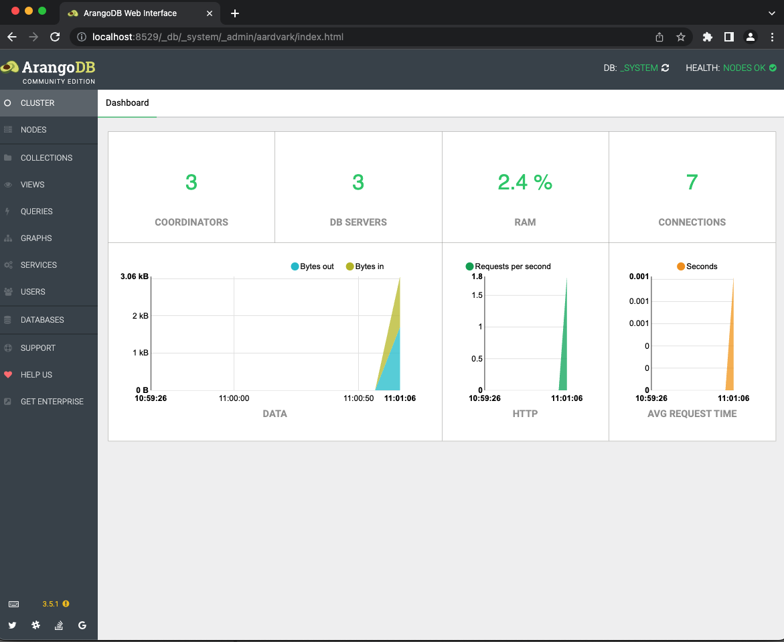
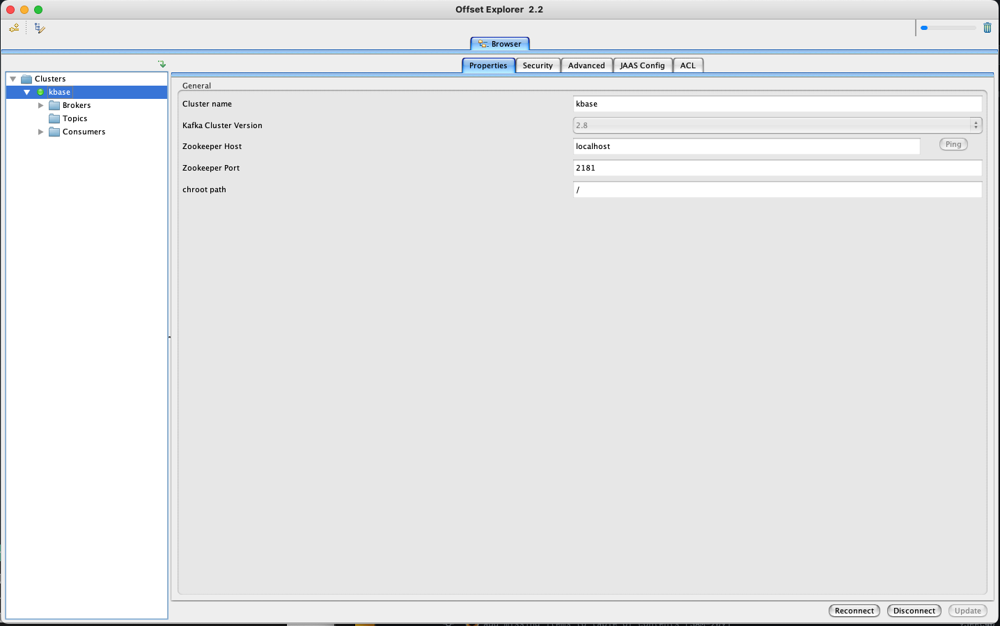

# Using Test Docker Compose

This document describes how to use and diagnose the test docker compose services. The test docker compose configuration defines services for ArangoDB, Kafka, and Zookeeper.

Each of these services operates inside the docker network, and is also exposed on the host machine on their usual ports.

- Arango: 8529
- Kafka: 9092, 9093
- Zookeeper: 2181

These services will be utilized by integration tests which either operate directly against them, or utilize sample service functionality which depends upon their operation.

## Starting

The test services are started with a single `make` task defined in the top level `Makefile`.

```shell
make host-start-test-services
```

## Stopping

The test services may be stopped by **Ctrl-C** in the terminal in which they were started, or by running the following make task in another terminal.

```shell
make host-stop-test-services
```

Even if stopping with **Ctrl-C**, you should run the above make task to remove the test containers. Since test containers will mount data directories, which will be populated during testing. Other than being good testing hygiene, the test startup script will assume that ArangoDB is empty and will attempt to create the expected collections. It will fail if the collections already exist.

Kafka it


## Inspecting via GUI Tools

It can be useful to inspect service dependencies to debug issues with tests. This section notes GUI clients which can be utilized with these services. Command line tools or the network interface to these services may be used as well, but that usage is not documented here.


### Arango

`arangodb` ships with the `Aardvark` gui tool. It is available when the service is started at port 8529. To launch the gui, just take your favorite browser to `http://localhost:8529`.



### Kafka and Zookeeper

`zookeeper` is an internal dependency of Kafka, and we should not need to bother with inspecting it.

`kafka` does not ship with a gui interface, but third party ones are available.

For instance, [Offset Explorer](https://offsetexplorer.com/index.html) is a cross-platform interface to both `kafka` and `zookeeper`.

